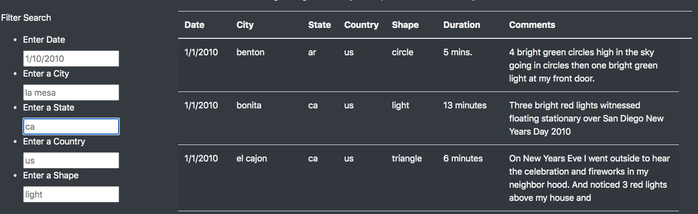
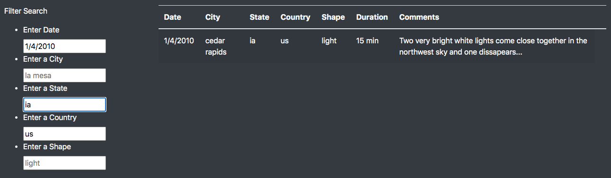

# UFOs
Working with Javascript-Module11

## Overwiew

The aim of this project is to organize the UFO sightings data and display it on a dynamic table with filters and share it ona webpage. 

## Results

* The webpage we designed includes a brief article on UFO sightings. 
* It includes a dynamic table displaying details on UFO sightings such as: date, city, state, country, shape, duration and comments.
* It is mobile-responsive which allows the data to be displayed as intended in other smaller devices.
* It also includes a table that filters data on multiple criteria.
* The filter table allows the user to filter the data up to 5 search criteria.
* When the search is complete the user can clear the filters to get it ready for the next search. 
* The images below shows filtered data on single and multiple search criteria.

                  

## Summary

* A drawback of the webpage is that it lack a "Clear Search" button. The user has to clear the search areas manually one by one in order to perform a new search.
* Thus, an addition of a "Clear Search" button will be very helpful in making the webpage more user-friendly.
* Another addition could be to include a "Comments" section for the webpage visitors to share their opinions and comments at the end of the webpage.
* Adding a scroll-up and scroll-down option for the article are will also result in a much better use of the available space on the webpage, especially on small devices.